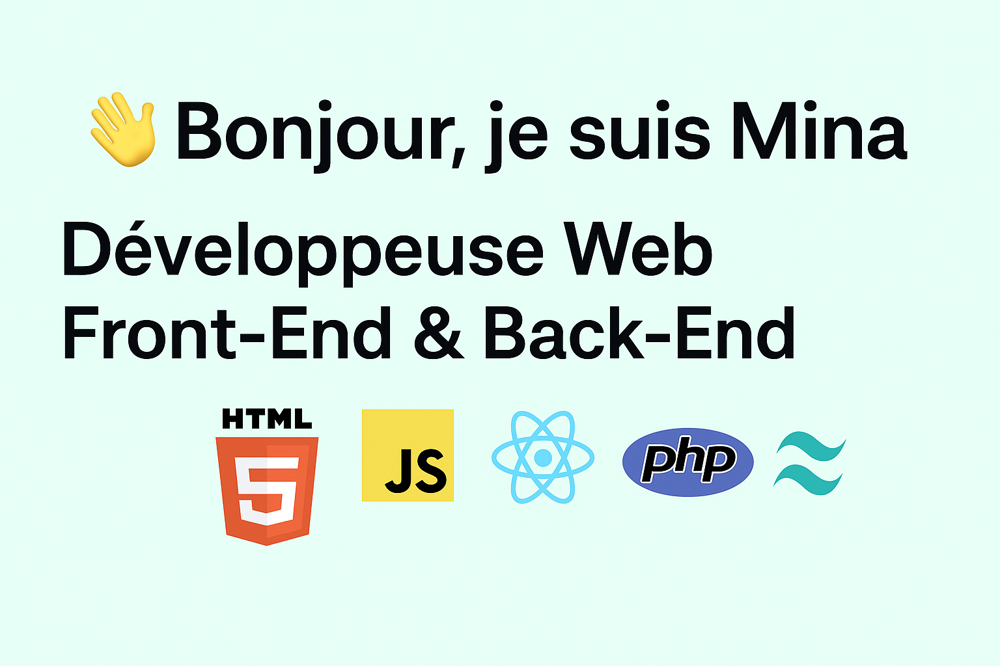

  

# 👋 Bonjour, je suis Mina

🎯 Étudiante en Bachelor IT Développement Web, je suis passionnée par la création de solutions digitales innovantes.  
Je conçois des projets complets en **front-end** et **back-end**, avec une attention particulière portée sur l'expérience utilisateur.

---

## 🔧 Compétences techniques

- **Langages** : HTML, CSS, JavaScript, PHP, SQL  
- **Frameworks & Librairies** : React.js, Vue.js, Node.js, Express.js  
- **Outils & Bases de données** : Git, GitHub, PhpMyAdmin, VS Code, MongoDB

---

## 📌 Projets en cours

- 🧑‍🍳 **Application de commande de burgers personnalisés**  
  ➤ Création et gestion de menus, authentification, interface responsive  
  ➤ [Voir le projet en ligne](https://burger-en-ligne.netlify.app)

- 🧩 **Portfolio personnel**  
  ➤ [Portfolio sur GitHub Pages](https://mine2r.github.io/portfolio)

---

## 📄 À propos de moi

- 🎓 Formation : Bachelor IT – La Plateforme  
- 🤝 En contrat pro avec des entreprises partenaires  
- 🌐 Axée mobile-first, UX, responsive design  

---

## 📫 Me contacter

- 📧 Email : [m.boussamgane@gmail.com](mailto:m.boussamgane@gmail.com)  
- 🔗 LinkedIn : [mina-boussamgane](https://www.linkedin.com/in/mina-boussamgane)  
- 📁 CV : [Télécharger le CV](https://minaboussamgane.netlify.app/CV.pdf)

---

## ⚡ Fun fact

Je transforme les défis en opportunités d'apprentissage. Curieuse, rigoureuse et créative, je construis des projets utiles et impactants. 🚀

